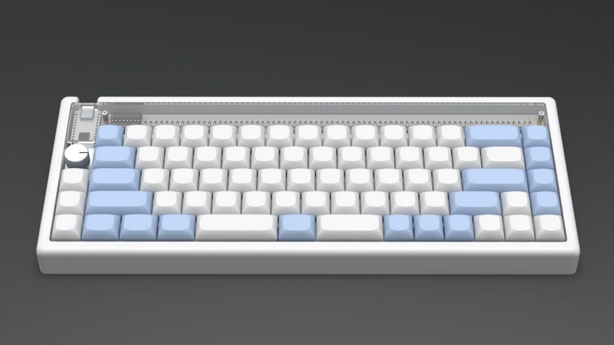

# Plover
A modern case for the 65% [Nibble](https://nullbits.co/nibble/) keyboard from [Nullbits](https://nullbits.co/)

## Features
- 2 cm front case height
- 5° typing angle
- Drop-in, one-piece style
- Replaces the bottom PCB on the Nibble
- Uses existing hardware from the base Nibble kit as much as possible

## Notes
- No support for TRRS connectors at this time
- Will require longer M2 screws for mounting
- Uses existing standoff locations
- I tried to design this with considerations for manufacturing via CNC or 3D Printing

## Possible Revisions
- Integrate standoffs into case bottom (?)
- Pattern for laser-cut silicone sheet to replace acrylic support
- TRRS support

## Other Stuff
Huge thanks to [Jay Greco / Nullbits](https://nullbits.co/) for designing really cool boards!

----
The files for this project are licensed under the CC 4.0 BY-SA license.